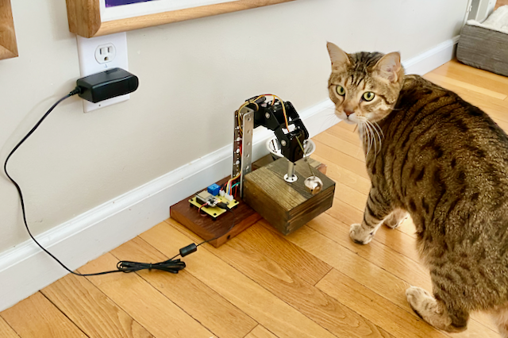

# CatFeeder

Instructions for an ESP32 controller to lock a cover over a catfood dish with an electromagnet when a button is pressed, and to move a servo arm to reveal the catfood (and ring a bell) at a scheduled time in the morning.

 

This is a project that I originally did using Raspberry Pi, now ported to ESP32.  Hardware is still the same as before, with the exception of a flyback diode added across the electromagnet to keep the controller from going insane.  See [FeederSchematic.pdf](FeederSchematic.pdf).

There are three servos connected in an arm that hold the lid (a wood box) over dish with catfood.  See [sketch.png](sketch.png).  In the code, the servos are named Shoulder, Elbow and Wrist.  Their relative positions are saved in non-volatile memory on the controller using the [Preferences.h](https://github.com/espressif/arduino-esp32/tree/master/libraries/Preferences) library.

Commands in the form of `<char><value>` can be sent to the device via AWS IoT or the serial port.  For example, `l99` locks the electromagnet and `l0` unlocks it. `f99` will do a full arm open, including a jiggle of the arm to ring a bell that I have attached to summon the cat.  There are also some commands for making minor adjustments to the servo positions.  See [CatFeeder.ino](CatFeeder.ino) for a complete list of commands (or enter `p99` to print all commands in the Arduino Serial Monitor).  
 
To send a command from AWS, publish a message in the form of {"command": "f99"} to the cat/commands topic.  Some things you'll need to learn: how to create, configure and secure an IoT thing on AWS core; how to write and depoloy a lambda function; how to configure AWS EventBridge to run that lambda function every morning.  See [lambda.py](lambda.py) and [this tutorial](https://aws.amazon.com/blogs/compute/building-an-aws-iot-core-device-using-aws-serverless-and-an-esp32/) to get you started.
 
The button on the circuit board will lock the lid over the food.  If the electromagnet is already locked, the button will do a full arm open with jiggle.  The normal usage is to load the cat dish, manually close the lid, press the button to lock the lid in place with the electromagnet, and then go to bed trusting that AWS IoT Core, Lambda, and EventBridge will do the rest. 
